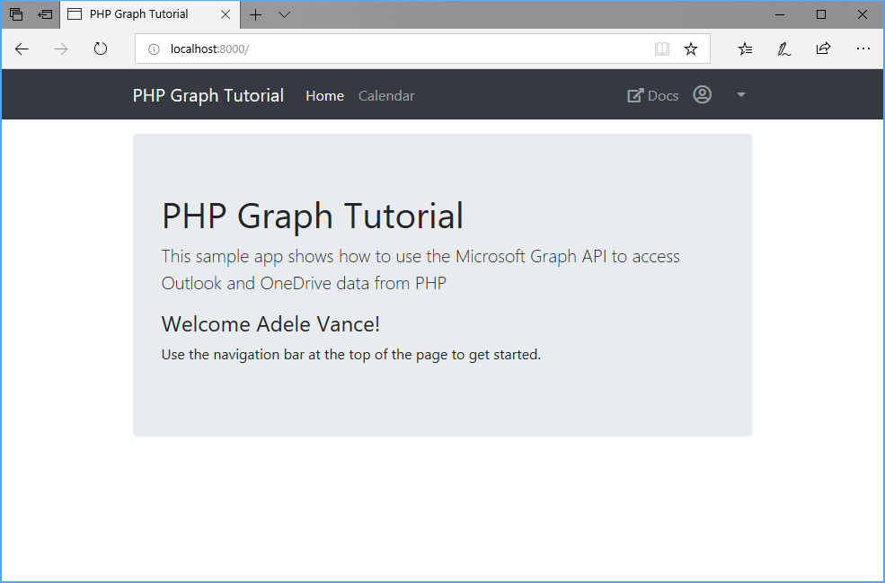
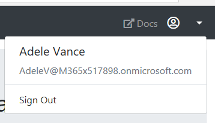

<!-- markdownlint-disable MD002 MD041 -->

在本练习中，你将扩展上一练习中的应用程序，以支持 Azure AD 的身份验证。 若要获取所需的 OAuth 访问令牌以调用 Microsoft Graph，这是必需的。 在此步骤中，将[oauth2-客户端](https://github.com/thephpleague/oauth2-client)库集成到应用程序中。

1. 打开 PHP `.env`应用程序的根目录中的文件，并将以下代码添加到该文件的末尾。

    :::code language="ini" source="../demo/graph-tutorial/.env.example" id="OAuthSettingsSnippet":::

1. 将`YOUR_APP_ID_HERE`替换为应用程序注册门户中的应用程序 ID， `YOUR_APP_PASSWORD_HERE`并将替换为您生成的密码。

    > [!IMPORTANT]
    > 如果您使用的是源代码管理（如 git），现在可以从源代码管理中排除`.env`该文件，以避免无意中泄漏您的应用程序 ID 和密码。

## <a name="implement-sign-in"></a>实施登录

1. 在 **/app/Http/Controllers**目录中创建一个名为`AuthController.php`的新文件，并添加以下代码。

    ```php
    <?php

    namespace App\Http\Controllers;

    use App\Http\Controllers\Controller;
    use Illuminate\Http\Request;

    class AuthController extends Controller
    {
      public function signin()
      {
        // Initialize the OAuth client
        $oauthClient = new \League\OAuth2\Client\Provider\GenericProvider([
          'clientId'                => env('OAUTH_APP_ID'),
          'clientSecret'            => env('OAUTH_APP_PASSWORD'),
          'redirectUri'             => env('OAUTH_REDIRECT_URI'),
          'urlAuthorize'            => env('OAUTH_AUTHORITY').env('OAUTH_AUTHORIZE_ENDPOINT'),
          'urlAccessToken'          => env('OAUTH_AUTHORITY').env('OAUTH_TOKEN_ENDPOINT'),
          'urlResourceOwnerDetails' => '',
          'scopes'                  => env('OAUTH_SCOPES')
        ]);

        $authUrl = $oauthClient->getAuthorizationUrl();

        // Save client state so we can validate in callback
        session(['oauthState' => $oauthClient->getState()]);

        // Redirect to AAD signin page
        return redirect()->away($authUrl);
      }

      public function callback(Request $request)
      {
        // Validate state
        $expectedState = session('oauthState');
        $request->session()->forget('oauthState');
        $providedState = $request->query('state');

        if (!isset($expectedState)) {
          // If there is no expected state in the session,
          // do nothing and redirect to the home page.
          return redirect('/');
        }

        if (!isset($providedState) || $expectedState != $providedState) {
          return redirect('/')
            ->with('error', 'Invalid auth state')
            ->with('errorDetail', 'The provided auth state did not match the expected value');
        }

        // Authorization code should be in the "code" query param
        $authCode = $request->query('code');
        if (isset($authCode)) {
          // Initialize the OAuth client
          $oauthClient = new \League\OAuth2\Client\Provider\GenericProvider([
            'clientId'                => env('OAUTH_APP_ID'),
            'clientSecret'            => env('OAUTH_APP_PASSWORD'),
            'redirectUri'             => env('OAUTH_REDIRECT_URI'),
            'urlAuthorize'            => env('OAUTH_AUTHORITY').env('OAUTH_AUTHORIZE_ENDPOINT'),
            'urlAccessToken'          => env('OAUTH_AUTHORITY').env('OAUTH_TOKEN_ENDPOINT'),
            'urlResourceOwnerDetails' => '',
            'scopes'                  => env('OAUTH_SCOPES')
          ]);

          try {
            // Make the token request
            $accessToken = $oauthClient->getAccessToken('authorization_code', [
              'code' => $authCode
            ]);

            // TEMPORARY FOR TESTING!
            return redirect('/')
              ->with('error', 'Access token received')
              ->with('errorDetail', $accessToken->getToken());
          }
          catch (League\OAuth2\Client\Provider\Exception\IdentityProviderException $e) {
            return redirect('/')
              ->with('error', 'Error requesting access token')
              ->with('errorDetail', $e->getMessage());
          }
        }

        return redirect('/')
          ->with('error', $request->query('error'))
          ->with('errorDetail', $request->query('error_description'));
      }
    }
    ```

    这将定义包含两个操作的`signin`控制器`callback`：和。

    该`signin`操作将生成 Azure AD 登录 URL，保存 OAuth `state`客户端生成的值，然后将浏览器重定向到 Azure AD 登录页。

    `callback`操作是 Azure 在登录完成后重定向的位置。 该操作确保`state`值与保存的值相匹配，然后由 Azure 发送的授权代码请求访问令牌。 然后，它使用临时错误值中的访问令牌重定向回主页。 在继续操作之前，你将使用此操作来验证登录是否正常工作。

1. 将路由添加到 **/routes/web.php**。

    ```php
    Route::get('/signin', 'AuthController@signin');
    Route::get('/callback', 'AuthController@callback');
    ```

1. 启动服务器并浏览到`https://localhost:8000`。 单击 "登录" 按钮，您应会被重定向`https://login.microsoftonline.com`到。 使用你的 Microsoft 帐户登录，并同意请求的权限。 浏览器重定向到应用程序，并显示令牌。

### <a name="get-user-details"></a>获取用户详细信息

在本节中，您将更新`callback`方法，以从 Microsoft Graph 获取用户的配置文件。

1. 将以下`use`语句添加到 **/app/Http/Controllers/AuthController.php**顶部的`namespace App\Http\Controllers;`行下方。

    ```php
    use Microsoft\Graph\Graph;
    use Microsoft\Graph\Model;
    ```

1. 将`callback`方法`try`中的块替换为以下代码。

    ```php
    try {
      // Make the token request
      $accessToken = $oauthClient->getAccessToken('authorization_code', [
        'code' => $authCode
      ]);

      $graph = new Graph();
      $graph->setAccessToken($accessToken->getToken());

      $user = $graph->createRequest('GET', '/me')
        ->setReturnType(Model\User::class)
        ->execute();

      // TEMPORARY FOR TESTING!
      return redirect('/')
        ->with('error', 'Access token received')
        ->with('errorDetail', 'User:'.$user->getDisplayName().', Token:'.$accessToken->getToken());
    }
    ```

新代码创建一个`Graph`对象，分配访问令牌，然后使用该令牌请求用户的配置文件。 它将用户的显示名称添加到临时输出中进行测试。

## <a name="storing-the-tokens"></a>存储令牌

现在，您可以获取令牌，现在是时候实现将它们存储在应用程序中的方法了。 由于这是一个示例应用程序，因此为简单起见，你将把它们存储在会话中。 实际应用程序将使用更可靠的安全存储解决方案，就像数据库一样。

1. 在 **/app**目录中创建一个名为`TokenStore`的新目录，然后在名为`TokenCache.php`的该目录中创建一个新文件，并添加以下代码。

    ```php
    <?php

    namespace App\TokenStore;

    class TokenCache {
      public function storeTokens($accessToken, $user) {
        session([
          'accessToken' => $accessToken->getToken(),
          'refreshToken' => $accessToken->getRefreshToken(),
          'tokenExpires' => $accessToken->getExpires(),
          'userName' => $user->getDisplayName(),
          'userEmail' => null !== $user->getMail() ? $user->getMail() : $user->getUserPrincipalName()
        ]);
      }

      public function clearTokens() {
        session()->forget('accessToken');
        session()->forget('refreshToken');
        session()->forget('tokenExpires');
        session()->forget('userName');
        session()->forget('userEmail');
      }

      public function getAccessToken() {
        // Check if tokens exist
        if (empty(session('accessToken')) ||
            empty(session('refreshToken')) ||
            empty(session('tokenExpires'))) {
          return '';
        }

        return session('accessToken');
      }
    }
    ```

1. 将以下`use`语句添加到位于 **/app/Http/Controllers/AuthController.php**顶部的`namespace App\Http\Controllers;`行下方。

    ```php
    use App\TokenStore\TokenCache;
    ```

1. 将现有`try` `callback`函数中的块替换为以下项。

    :::code language="php" source="../demo/graph-tutorial/app/Http/Controllers/AuthController.php" id="StoreTokensSnippet":::

## <a name="implement-sign-out"></a>实现注销

在测试此新功能之前，请添加一种注销方式。

1. 将以下操作添加到`AuthController`类中。

    :::code language="php" source="../demo/graph-tutorial/app/Http/Controllers/AuthController.php" id="SignOutSnippet":::

1. 将此操作添加到 **/routes/web.php**。

    ```php
    Route::get('/signout', 'AuthController@signout');
    ```

1. 重新启动服务器并完成登录过程。 您应该最后返回到主页，但 UI 应更改以指示您已登录。

    

1. 单击右上角的用户头像以访问 "**注销**" 链接。 单击 "**注销**" 重置会话并返回到主页。

    

## <a name="refreshing-tokens"></a>刷新令牌

此时，您的应用程序具有访问令牌，该令牌是在 API `Authorization`调用的标头中发送的。 这是允许应用代表用户访问 Microsoft Graph 的令牌。

但是，此令牌的生存期较短。 令牌在发出后会过期一小时。 这就是刷新令牌变得有用的地方。 刷新令牌允许应用在不要求用户重新登录的情况下请求新的访问令牌。 更新令牌管理代码以实现令牌刷新。

1. 打开 **/app/TokenStore/TokenCache.php** ，并将以下函数添加到`TokenCache`类中。

    :::code language="php" source="../demo/graph-tutorial/app/TokenStore/TokenCache.php" id="UpdateTokensSnippet":::

1. 将现有的 `getAccessToken` 函数替换为以下内容。

    :::code language="php" source="../demo/graph-tutorial/app/TokenStore/TokenCache.php" id="GetAccessTokenSnippet":::

此方法首先检查访问令牌是否已过期或接近即将过期。 如果是，则它使用刷新令牌获取新令牌，然后更新缓存并返回新的访问令牌。
