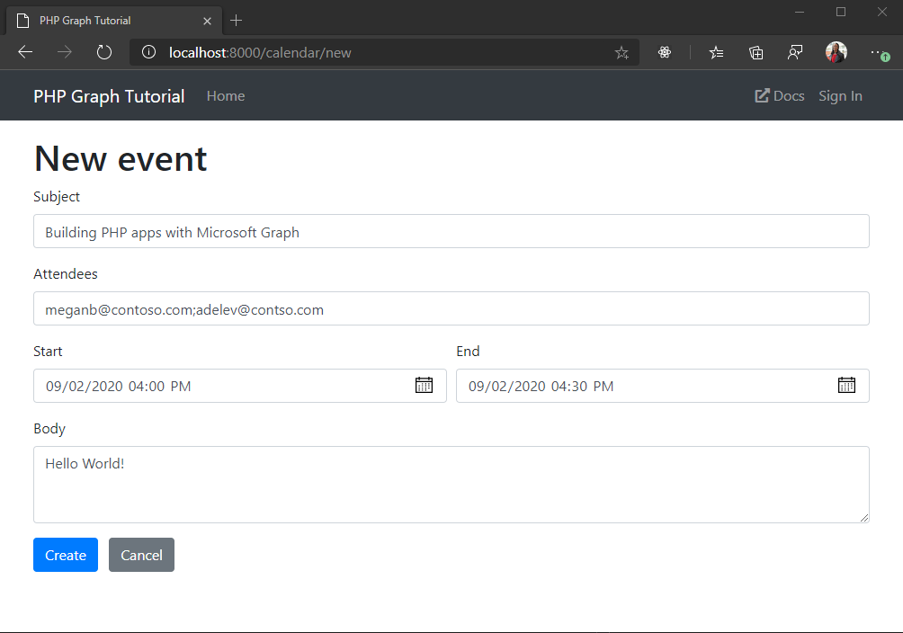

<!-- markdownlint-disable MD002 MD041 -->

在本节中，您将添加在用户日历上创建事件的功能。

## <a name="create-new-event-form"></a>创建新的事件表单

1. 在 **/resources/views** 目录中创建一个名为的新文件 `newevent.blade.php` ，并添加以下代码。

    :::code language="php" source="../demo/graph-tutorial/resources/views/newevent.blade.php" id="NewEventFormSnippet":::

## <a name="add-controller-actions"></a>添加控制器操作

1. 打开 **/app/Http/Controllers/CalendarController.php** ，并添加以下函数以呈现表单。

    :::code language="php" source="../demo/graph-tutorial/app/Http/Controllers/CalendarController.php" id="getNewEventFormSnippet":::

1. 添加以下函数以在用户提交时接收表单数据，并在用户的日历上创建一个新事件。

    :::code language="php" source="../demo/graph-tutorial/app/Http/Controllers/CalendarController.php" id="createNewEventSnippet":::

    请考虑此代码执行的操作。

    - 它将 "与会者" 字段输入转换为 Graph [与会者](https://docs.microsoft.com/graph/api/resources/attendee?view=graph-rest-1.0) 对象的数组。
    - 它生成来自表单输入的 [事件](https://docs.microsoft.com/graph/api/resources/event?view=graph-rest-1.0) 。
    - 它向终结点发送一篇文章 `/me/events` ，然后重定向回 "日历" 视图。

1. 更新 **/routes/web.php** 中的路由，以在控制器上为这些新函数添加路由。

    ```php
    Route::get('/calendar/new', 'CalendarController@getNewEventForm');
    Route::post('/calendar/new', 'CalendarController@createNewEvent');
    ```

1. 保存所有更改，然后重新启动服务器。 使用 " **新建事件** " 按钮导航到新的事件窗体。

1. 填写表单上的值。 使用从当前周开始的日期。 选择“创建”****。

    

1. 当应用程序重定向到 "日历" 视图时，请验证结果中是否存在您的新事件。
