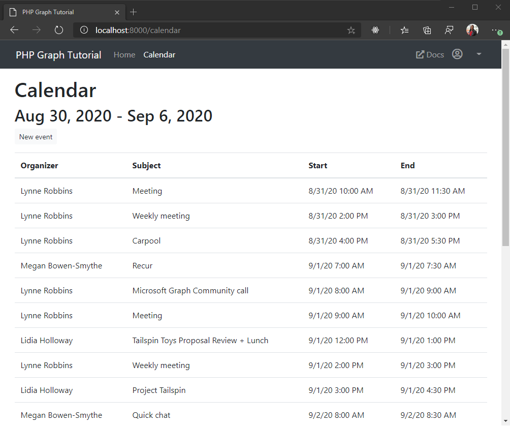

<!-- markdownlint-disable MD002 MD041 -->

<span data-ttu-id="94a97-101">在本练习中, 将把 Microsoft Graph 合并到应用程序中。</span><span class="sxs-lookup"><span data-stu-id="94a97-101">In this exercise you will incorporate the Microsoft Graph into the application.</span></span> <span data-ttu-id="94a97-102">对于此应用程序, 您将使用[microsoft graph](https://github.com/microsoftgraph/msgraph-sdk-php)库对 microsoft graph 进行调用。</span><span class="sxs-lookup"><span data-stu-id="94a97-102">For this application, you will use the [microsoft-graph](https://github.com/microsoftgraph/msgraph-sdk-php) library to make calls to Microsoft Graph.</span></span>

## <a name="get-calendar-events-from-outlook"></a><span data-ttu-id="94a97-103">从 Outlook 获取日历事件</span><span class="sxs-lookup"><span data-stu-id="94a97-103">Get calendar events from Outlook</span></span>

<span data-ttu-id="94a97-104">让我们先为日历视图添加一个控制器。</span><span class="sxs-lookup"><span data-stu-id="94a97-104">Let's start by adding a controller for the calendar view.</span></span> <span data-ttu-id="94a97-105">在名为`./app/Http/Controllers` `CalendarController.php`的文件夹中创建一个新文件, 并添加以下代码。</span><span class="sxs-lookup"><span data-stu-id="94a97-105">Create a new file in the `./app/Http/Controllers` folder named `CalendarController.php`, and add the following code.</span></span>

```php
<?php

namespace App\Http\Controllers;

use App\Http\Controllers\Controller;
use Illuminate\Http\Request;
use Microsoft\Graph\Graph;
use Microsoft\Graph\Model;
use App\TokenStore\TokenCache;

class CalendarController extends Controller
{
  public function calendar()
  {
    $viewData = $this->loadViewData();

    // Get the access token from the cache
    $tokenCache = new TokenCache();
    $accessToken = $tokenCache->getAccessToken();

    // Create a Graph client
    $graph = new Graph();
    $graph->setAccessToken($accessToken);

    $queryParams = array(
      '$select' => 'subject,organizer,start,end',
      '$orderby' => 'createdDateTime DESC'
    );

    // Append query parameters to the '/me/events' url
    $getEventsUrl = '/me/events?'.http_build_query($queryParams);

    $events = $graph->createRequest('GET', $getEventsUrl)
      ->setReturnType(Model\Event::class)
      ->execute();

    return response()->json($events);
  }
}
```

<span data-ttu-id="94a97-106">考虑此代码执行的操作。</span><span class="sxs-lookup"><span data-stu-id="94a97-106">Consider what this code is doing.</span></span>

- <span data-ttu-id="94a97-107">将调用的 URL 为`/v1.0/me/events`。</span><span class="sxs-lookup"><span data-stu-id="94a97-107">The URL that will be called is `/v1.0/me/events`.</span></span>
- <span data-ttu-id="94a97-108">`$select`参数将为每个事件返回的字段限制为仅显示视图实际使用的字段。</span><span class="sxs-lookup"><span data-stu-id="94a97-108">The `$select` parameter limits the fields returned for each events to just those the view will actually use.</span></span>
- <span data-ttu-id="94a97-109">`$orderby`参数按其创建日期和时间对结果进行排序, 最新项目最先开始。</span><span class="sxs-lookup"><span data-stu-id="94a97-109">The `$orderby` parameter sorts the results by the date and time they were created, with the most recent item being first.</span></span>

<span data-ttu-id="94a97-110">更新中`./routes/web.php`的路由以将路由添加到此新控制器</span><span class="sxs-lookup"><span data-stu-id="94a97-110">Update the routes in `./routes/web.php` to add a route to this new controller</span></span>

```php
Route::get('/calendar', 'CalendarController@calendar');
```

<span data-ttu-id="94a97-111">现在, 您可以对此进行测试。</span><span class="sxs-lookup"><span data-stu-id="94a97-111">Now you can test this.</span></span> <span data-ttu-id="94a97-112">登录并单击导航栏中的 "**日历**" 链接。</span><span class="sxs-lookup"><span data-stu-id="94a97-112">Sign in and click the **Calendar** link in the nav bar.</span></span> <span data-ttu-id="94a97-113">如果一切正常, 应在用户的日历上看到一个 JSON 转储的事件。</span><span class="sxs-lookup"><span data-stu-id="94a97-113">If everything works, you should see a JSON dump of events on the user's calendar.</span></span>

## <a name="display-the-results"></a><span data-ttu-id="94a97-114">显示结果</span><span class="sxs-lookup"><span data-stu-id="94a97-114">Display the results</span></span>

<span data-ttu-id="94a97-115">现在, 您可以添加一个视图, 以对用户更友好的方式显示结果。</span><span class="sxs-lookup"><span data-stu-id="94a97-115">Now you can add a view to display the results in a more user-friendly manner.</span></span> <span data-ttu-id="94a97-116">在名为`./resources/views` `calendar.blade.php`的目录中创建一个新文件, 并添加以下代码。</span><span class="sxs-lookup"><span data-stu-id="94a97-116">Create a new file in the `./resources/views` directory named `calendar.blade.php` and add the following code.</span></span>

```php
@extends('layout')

@section('content')
<h1>Calendar</h1>
<table class="table">
  <thead>
    <tr>
      <th scope="col">Organizer</th>
      <th scope="col">Subject</th>
      <th scope="col">Start</th>
      <th scope="col">End</th>
    </tr>
  </thead>
  <tbody>
    @isset($events)
      @foreach($events as $event)
        <tr>
          <td>{{ $event->getOrganizer()->getEmailAddress()->getName() }}</td>
          <td>{{ $event->getSubject() }}</td>
          <td>{{ \Carbon\Carbon::parse($event->getStart()->getDateTime())->format('n/j/y g:i A') }}</td>
          <td>{{ \Carbon\Carbon::parse($event->getEnd()->getDateTime())->format('n/j/y g:i A') }}</td>
        </tr>
      @endforeach
    @endif
  </tbody>
</table>
@endsection
```

<span data-ttu-id="94a97-117">这将遍历一组事件并为每个事件添加一个表行。</span><span class="sxs-lookup"><span data-stu-id="94a97-117">That will loop through a collection of events and add a table row for each one.</span></span> <span data-ttu-id="94a97-118">从中`return response()->json($events);`的`calendar`操作中`./app/Http/Controllers/CalendarController.php`删除该行, 并将其替换为以下代码。</span><span class="sxs-lookup"><span data-stu-id="94a97-118">Remove the `return response()->json($events);` line from the `calendar` action in `./app/Http/Controllers/CalendarController.php`, and replace it with the following code.</span></span>

```php
$viewData['events'] = $events;
return view('calendar', $viewData);
```

<span data-ttu-id="94a97-119">刷新页面, 应用现在应呈现一个事件表。</span><span class="sxs-lookup"><span data-stu-id="94a97-119">Refresh the page and the app should now render a table of events.</span></span>

