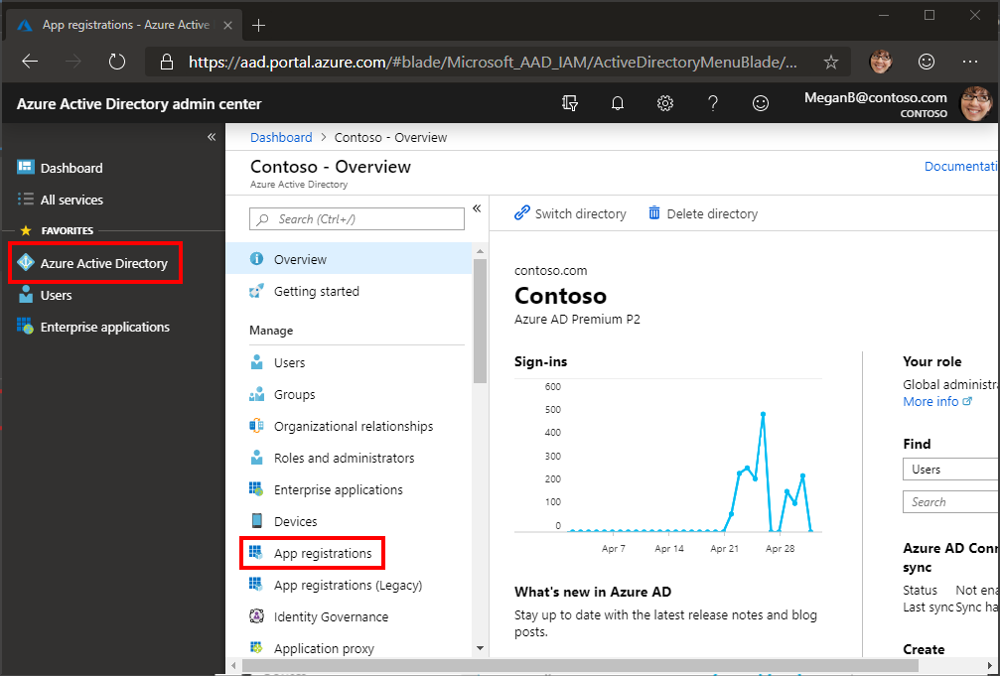
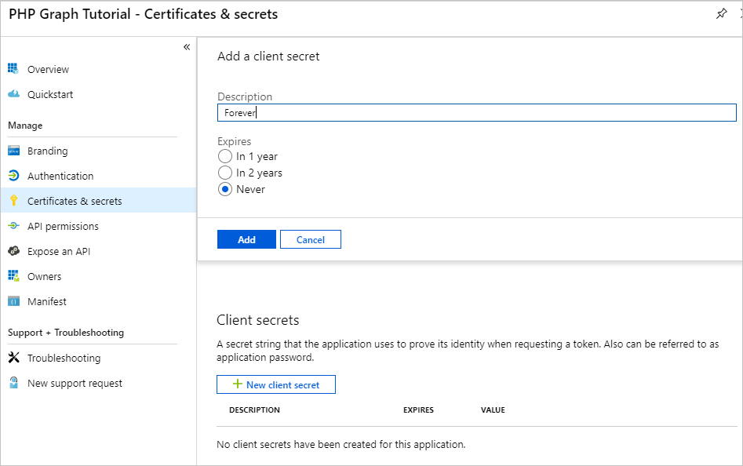

<!-- markdownlint-disable MD002 MD041 -->

在本练习中, 你将使用 azure Active Directory 管理中心创建新的 azure AD web 应用程序注册。

1. 打开浏览器并导航到[Azure Active Directory 管理中心](https://aad.portal.azure.com)。 使用**个人帐户**(亦称: Microsoft 帐户) 或**工作或学校帐户**登录。

1. 在左侧导航栏中选择 " **Azure Active Directory** ", 然后选择 "**管理**" 下的 "**应用注册 (预览)** "。

    

1. 选择 "**新建注册**"。 在 "**注册应用程序**" 页上, 按如下所示设置值。

    - 将**名称**设置`PHP Graph Tutorial`为。
    - 将**支持的帐户类型**设置为**任何组织目录和个人 Microsoft 帐户中的帐户**。
    - 在 "**重定向 URI**" 下, 将第一个`Web`下拉下拉箭头, 并`http://localhost:8000/callback`将值设置为。

    

1. 选择 "**注册**"。 在 " **PHP Graph 教程**" 页上, 复制**应用程序 (客户端) ID**的值并保存它, 下一步将需要它。

    

1. 选择 "**管理**" 下的 "**证书 & 密码**"。 选择 "**新客户端密码**" 按钮。 在 "**说明**" 中输入一个值, 然后选择 "**过期**" 选项之一, 然后选择 "**添加**"。

    

1. 在离开此页面之前复制客户端密码值。 您将在下一步中需要它。

    > [!IMPORTANT]
    > 此客户端密码永远不会再次显示, 因此请务必立即复制。

    